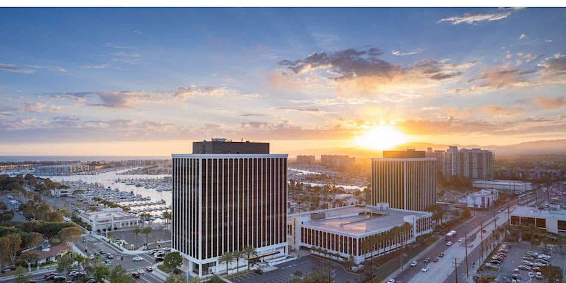
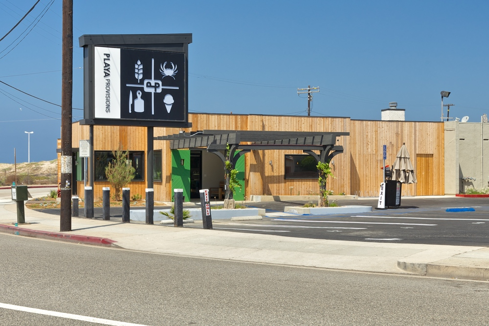

# Social Events

All social events will be held within a short distance of ISI and will take advantage of Southern California’s excellent climate and proximity to the ocean.
ISI is located on the water in the Marina and has close access to walking and biking paths that stretch along the Los Angeles coastline for miles in each direction.
The Marina is home to many waterfront dining establishments.

## Welcome Reception at ISI

The opening reception will be a catered event with appetizers and drinks held in ISI's 11th floor multipurpose conference room with panoramic views of the Marina, Pacific Ocean, Santa Monica Mountains, and West Los Angeles skyline. The reception will feature poster and demo presentations.
The reception will be held on the evening of **Monday, July 10, 2023**.

## Conference Banquet at Playa Provisions

The conference banquet will be held at [Playa Provisions](https://www.playaprovisions.com/) located in nearby Playa del Rey. 
Bus services will be provided to and from Playa del Rey so that attendees can avoid driving and parking in the popular beach city.
The banquet schedule will allow ample time for walking or biking along the bike path in Playa del Rey, where there are bikes for rent nearby.
The banquet will be held on the evening of **Tuesday, July 11, 2023**.

From the restaurant: "Playa Provisions is the third endeavor for Top Chef Winner Brooke Williamson and husband Nick Roberts. The unique model includes four different restaurant concepts nestled within one 7,000-square foot, beach side location. King Beach cafe offers casual breakfast and lunch fair. For dinner, Dockside exemplifies both Brooke and Nick’s love for California coastal cuisine at an intimate dining room and beach side patio. After dinner stop by Small Batch for a pint of house made ice cream, or sneak into the back and enjoy some darker spirits at Grain Whiskey Bar. Inspired by the city's "country marts," the four separate, yet cohesive dining experiences provide a taste for everyone."

Please visit this page again for updates on more events and further details as they are made available.
