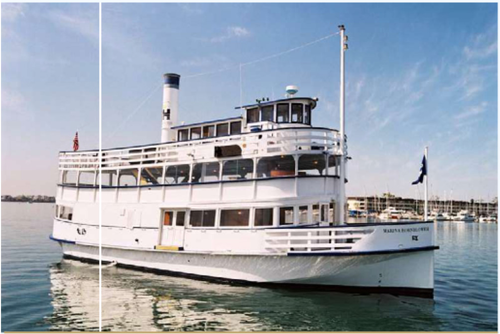
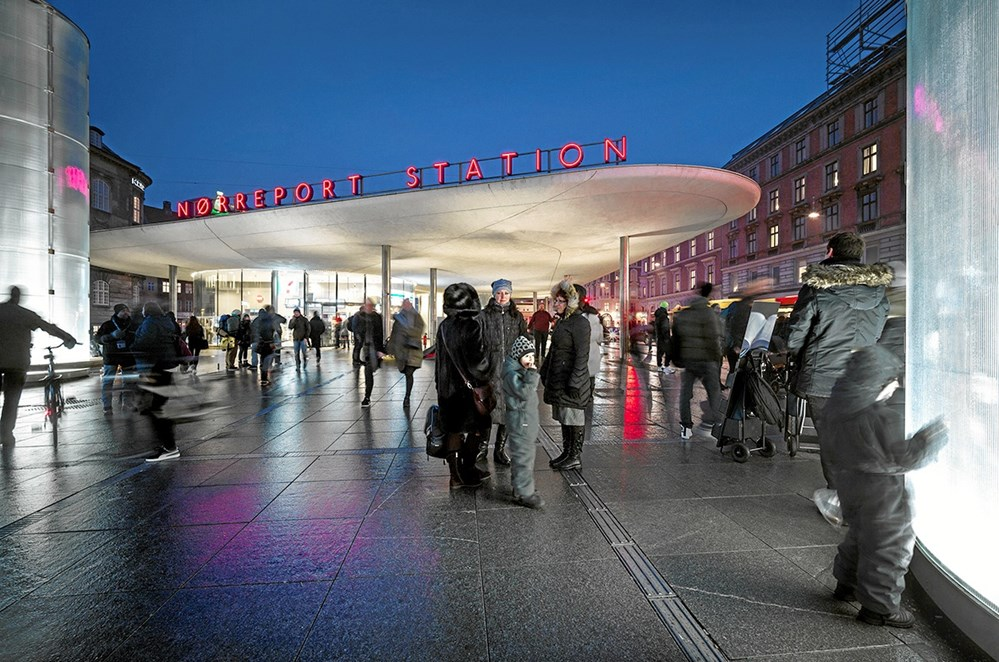
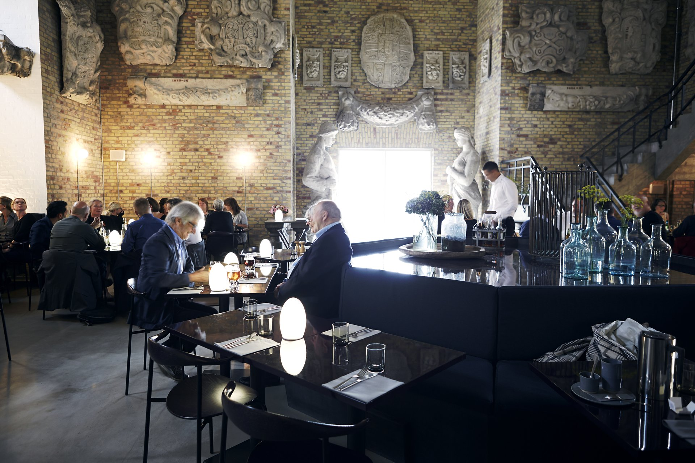
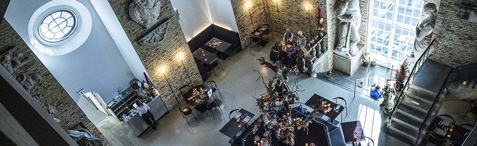
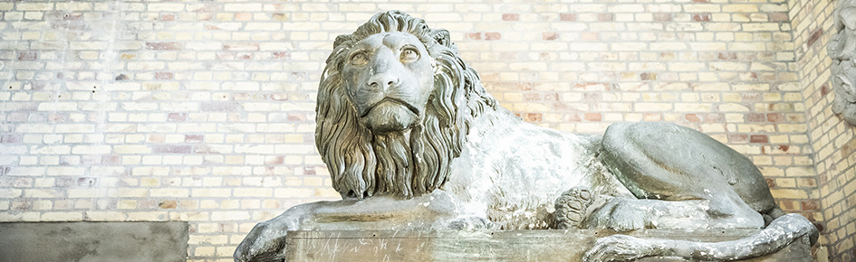
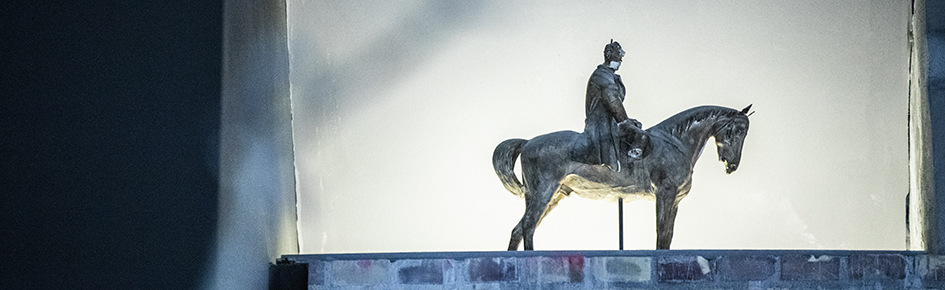

# Social Events

## Welcome Reception

All social events will be held within walking distance of ISI and will take advantage of Southern California’s excellent climate and proximity to the ocean.

We plan to hold an opening reception at a local restaurant that is walking distance from ISI and local marina hotels. This facility features an outside patio on the water, and we propose to have a cash bar and provide heavy appetizers for attendees.

## Marina Boat tours
ISI is located on the water in the Marina and has close access to a charter boat service. We plan to schedule a three-hour boat tour with dinner arranged for **Tuesday July 11th, 2023**. Dinner will be sit-down and will take place on the boat as part of the tour.

Please visit this page again for updates on more events and further details as they are made available.


Thursday, July 7

## Copenhagen Walking Tour (17:20 - 19:00)

The tour will start from Nørreport Station and end at Christiansborg Palace. Nørreport Station is reachable by bus from the venue. After getting off at Nørreport Station, you should locate the shop "Matas" at Nørreport Station, where you should meet the guide. For your convenience, there will be a convoy starting from the venue at 16:45, taking the bus to Nørreport Station.

Nørreport Station

Christiansborg Palace

## Banquet at Restaurant Tårnet (19:00 - 21:30)

Restaurant Tårnet is located inside the tower of Christiansborg Palace, where the walking tour ends. With its 106 metres, the Christiansborg Palace tower is the highest in Copenhagen and offers a magnificent view of the city's rooftops. It is free to access the tower. There is a lift from the entrance to the top of the tower. The observation tower is just above the restaurant, which means that you can take the lift up to the top and overlook Copenhagen before or during your dinner.

Restaurant Tårnet

