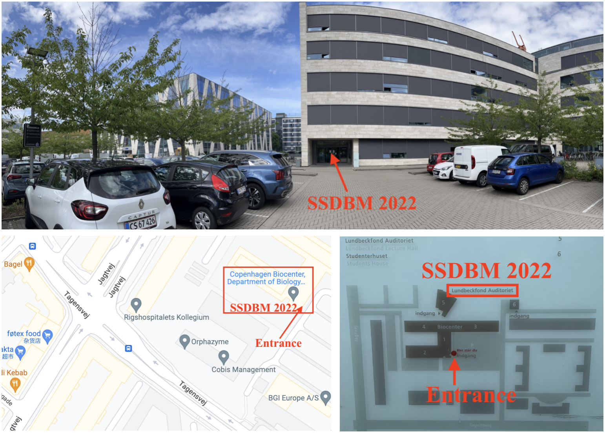
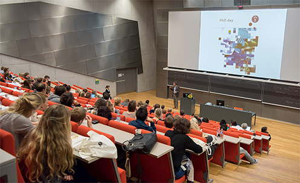
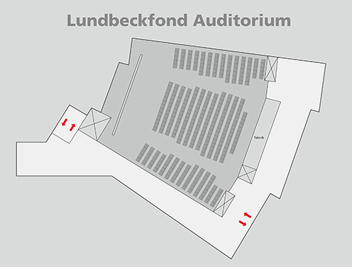
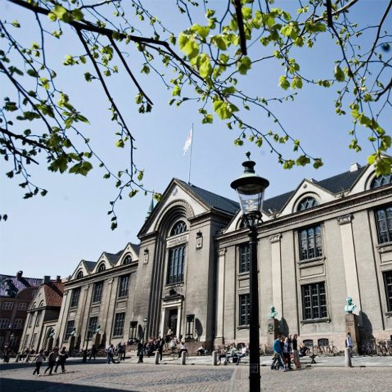
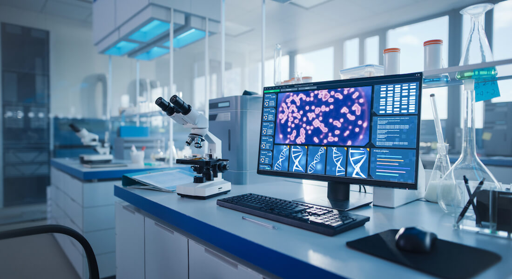
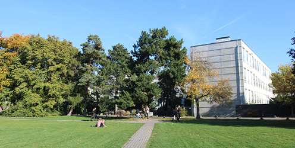
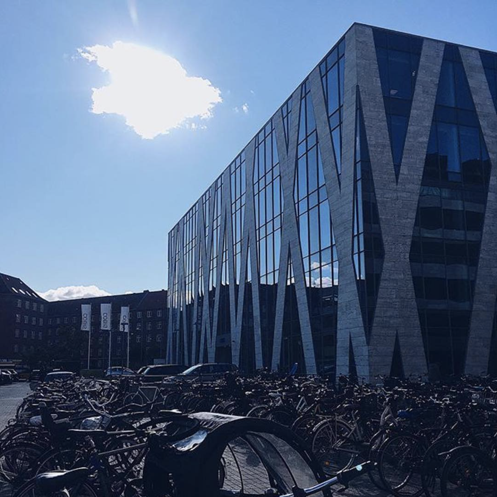
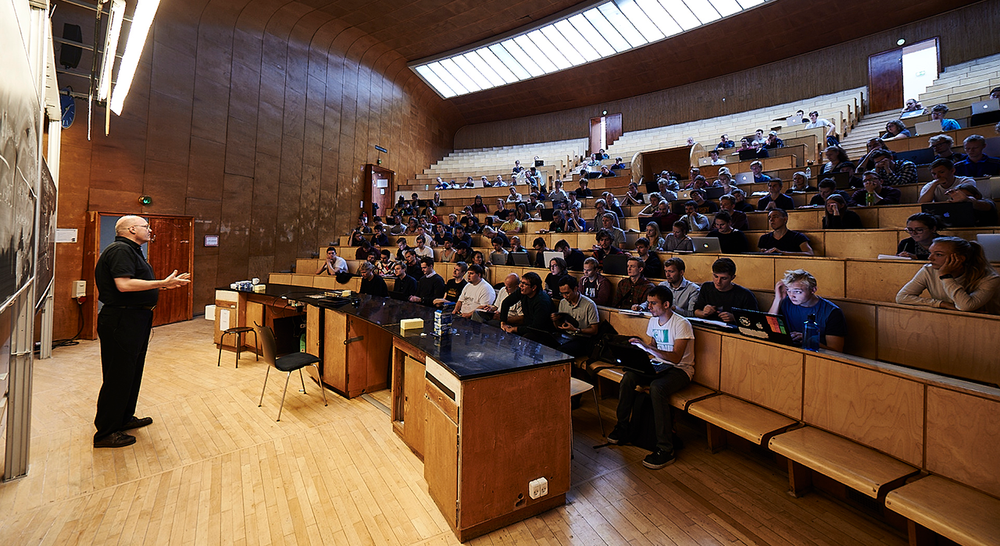

# Conference Venue

The conference will be held in the **University of Southern California’s Information Sciences Institute (USC/ISI)**. ISI is an off-campus research institute located in Marina del Rey, California USA (in the Greater Los Angeles Area). One of the largest computer science research institutes in the country, ISI has played a critical role in creation of computing technology including the development of DNS, serving as RFC editor, and development of Grid Computing technologies. In addition to housing over 100 researchers, the ISI facility is home to a Quantum Computing facility, and operates the Root B server for the Internet Domain Name Service.

The ISI facility is conveniently located with respect to Los Angles International Airport, providing easy access from any international and domestic location.

[//]: # (Insert Figure 1 Map)
[//]: # (Insert Figure 2 Picture of ISI building)

We have booked the two ISI conference rooms for the main conference. Each room can accommodate 80 people configured in theater style configuration. We will use one room for the main meeting and use the second room for lunch and poster sessions.

ISI is also walking distance from Burton Chase park. We will provide box lunches during the meeting allowing attendees to have the option to eat in a dining area we will have set up in the building, or making a 10 minute walk to the park to eat while overlooking the ocean.

[//]: # (Insert Figure -- Chase park)
[//]: # (Insert Figure 3 conf room layout)

Lunches, breaks, and the poster and demo sessions will be held in the 11th floor conference room in the building. In addition, there are a number of additional intermediate sized rooms the ISI facility that can be used for breakout rooms.


The conference will be held at the **Lundbeckfond Auditorium, Biocenter, North Campus** of University of Copenhagen. The Lundbeckfond Auditorium was donated by the Lundbeck Foundation and can accommodate 340 people.

**Notice**: Due to the summer vacation, the Biocenter building has all the doors locked. If you cannot get into the building, please contact (SMS) our assistant Yijian (+45 50385640) and she will open the door for you.

- Address of the Biocenter building: [Ole Maaløes Vej 5, 2200 København](https://goo.gl/maps/TCF1c8Qn1RbB5TaC9)
- The Lundbeckfond Auditorium is located on the ground floor of Biocenter. Check the [building map](https://www.biocenter.ku.dk/english/map/) to find the auditorium.

## University of Copenhagen

Driven by intellectual creativity and critical thinking since 1479, researchers and students at the University of Copenhagen have expanded horizons and contributed to moving the world forward. With its 5,000 researchers and 37,500 students, the University boasts an international research and study environment and is highly ranked on the leading ranking lists of the world's best universities.

The University offers researchers and students the opportunity to develop their talent and launches ambitious interdisciplinary initiatives to support its strong academic communities. Through research-based teaching – and by involving them in research – students are equipped to address society's challenges and needs.

The University of Copenhagen is working towards becoming one of the world’s greenest campus areas, leaving as little environmental and climate footprint as possible. The University facilitates cross-organisation collaboration, liaises with the business community and helps students find relevant programmes and projects in the field of sustainability.

The University also focuses on gender equality and sees diversity as a strength.

## Department of Computer Science (DIKU)

Department of Computer Science at University of Copenhagen (DIKU) is the first computer science department in Denmark, established by Peter Naur in 1970. Since then, our researchers and graduates have formed the basis for society’s accelerating technological transformation, and our research environment and results have made us one of Europe’s leading and most attractive computer science departments.

## North Campus

Natural science and human life and health are in focus at North Campus, which contains both the Faculty of Science (SCIENCE) and the Faculty of Health and Medical Sciences (SUND). At North Campus, you can visit the Zoological Museum and experience the city from the top of the Mærsk Tower, among other things. Copenhagen's largest, and very popular park, Fælledparken, is within a stone's throw.

North Campus lies in the triangle between Nørre Allé, Jagtvej and Tagensvej. In addition, you can access the Niels Bohr Institute and the Panum Institute via Blegdamsvej.

