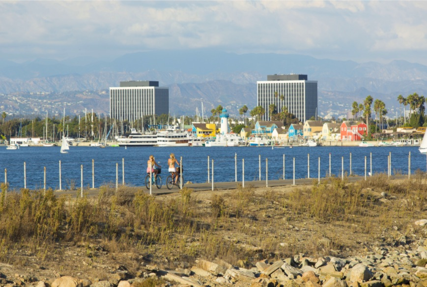
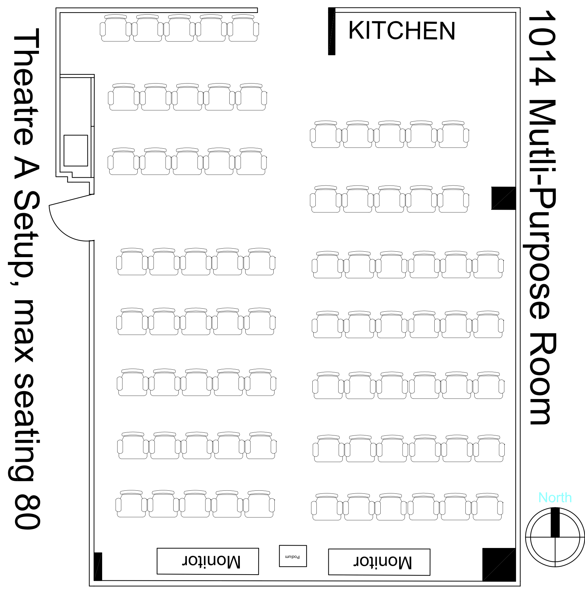
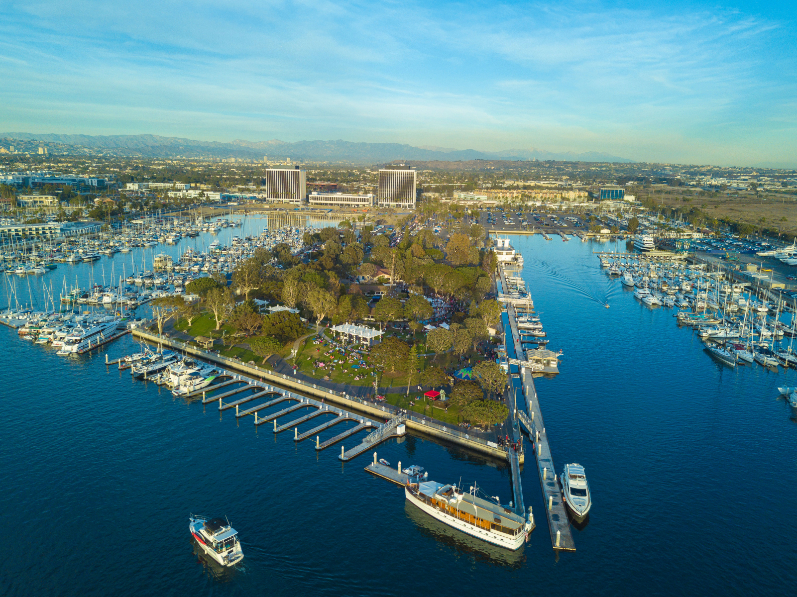
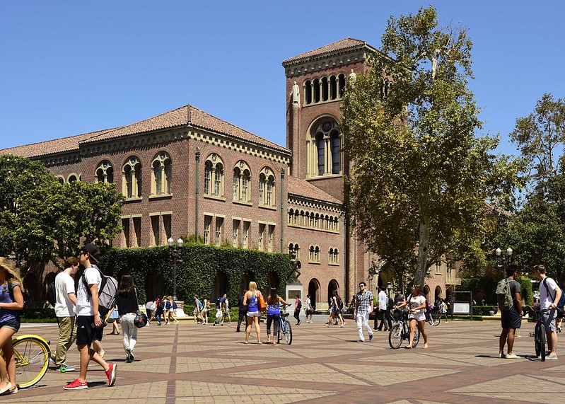

# Conference Venue

The conference will be held in the [University of Southern California’s Information Sciences Institute (USC/ISI)](https://www.isi.edu/)
at [4676 Admiralty Way, Suite 1001, Marina del Rey, CA 90292](https://www.isi.edu/contact/#locations)
([Directions](https://goo.gl/maps/2f9C6U5hdMS3SQut9)).

<iframe src="https://www.google.com/maps/embed?pb=!1m18!1m12!1m3!1d3308.473485747846!2d-118.44266112306653!3d33.98037002151968!2m3!1f0!2f0!3f0!3m2!1i1024!2i768!4f13.1!3m3!1m2!1s0x80c2ba807dea72f9%3A0x1e85548fc5979edf!2s4676%20Admiralty%20Way%2C%20Marina%20Del%20Rey%2C%20CA%2090292!5e0!3m2!1sen!2sus!4v1686073161085!5m2!1sen!2sus" width="600" height="450" style="border:0;" allowfullscreen="" loading="lazy" referrerpolicy="no-referrer-when-downgrade"></iframe>

The ISI facility is conveniently located with respect to Los Angeles International Airport (LAX), providing easy access from any international and domestic location.

### USC Information Sciences Institute

ISI is an off-campus research institute located in Marina del Rey, California USA (in the Greater Los Angeles Area). One of the largest computer science research institutes in the country, ISI has played a critical role in creation of computing technology including the development of DNS, serving as RFC editor, and development of Grid Computing technologies. In addition to housing over 100 researchers, the ISI facility is home to a Quantum Computing facility, and operates the Root B server for the Internet Domain Name Service.

Two ISI conference rooms are reserved for the main conference. Each room can accommodate 80 people arranged in theater style configuration. One room will be used for the main meeting and the second room used for lunch and poster sessions.

ISI is also walking distance from [Burton W. Chase Park](https://visitmdr.com/things-to-do/beaches-and-parks/burton-w-chace-park). Box lunches will be provided during the meeting allowing attendees to have the option to eat in a dining area set up in the ISI building, or making a 10 minute walk to the park to eat while overlooking the ocean.

Lunches, breaks, and the poster and demo sessions will be held in the 11th floor conference room in the building. In addition, there are a number of additional intermediate sized rooms in the ISI facility that can be used for breakout rooms.

ISI is located within reach of many [Los Angeles area attractions](https://visitmdr.com/2021/09/27/los-angeles-attractions-near-marina-del-rey), including [Venice Beach](https://www.laparks.org/venice/), Santa Monica Pier, Hollywood studio tours, amusement parks, and museums.
For the month of July, the historical average temperatures are a high of 75°F (23°C) and lows of 64°F (18°C) along the coast.

### University of Southern California

The [University of Southern California](https://www.usc.edu) is a leading private research university located in Los Angeles — a global center for arts, technology and international business. It is home to the College of Letters, Arts and Sciences and 22 exceptional academic schools and units. USC’s Health Sciences campus houses renowned specialized care and research in cancer, stem cell and regenerative medicine, orthopedics and sports medicine. The university is the largest private sector employer in the city of Los Angeles, responsible for $8 billion annually in economic activity in the region.

