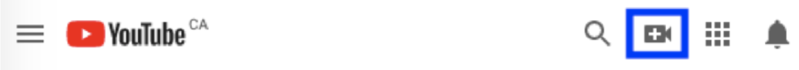

# Video Submission Instructions

1. Sign in to [YouTube](https://www.youtube.com/).

2. At the top right corner, select the **Create video or more** button -> **Upload Video**.
    

3. Select the video file you would like to upload.

4. While your video is being processed, click on “**Details**” of the video to fill in information. Your video title should be in the following format: **TITLE (SSDBM 2023)**.

5. In the description section, please include the track (Research, Industry, Grand Challenge, …), paper ID (which can be found from Microsoft CMT) and the names of the authors.

6. Under visibility, please select “Unlisted” or “Public”. The difference is that an unlisted video will not be indexed by the YouTube search engine. Click “**Save**” once done.

7. You can optionally go to the “**Subtitles**” section to manually enter subtitles for your video, which will be displayed during the live broadcast. **Please ensure the subtitles are accurate**.

8. Once your video is available, please copy the link by viewing the video page on YouTube and sharing its link.

9. The video duration should be maximum **20 minutes for long papers** and **10 minutes for short papers**.

10. Authors may use an optional virtual background.


# Instructions for Emailing Your YouTube Video Link

Please send the video link by email to the [PC chair](mailto:schuler@isi.edu) by July 5, 2023 (anytime) according to the following instructions:

1. Email subject must be titled with your paper ID and presenter last name: **SSDBM 2023 Video Link: PAPERID#_PRESENTER-LASTNAME**

2. Email body should contain:
  - Paper ID and track
  - YouTube video link
  - Name of the speaker in the video
  - A short 3-4 lines biography of the speaker

Below is a sample format for the email:

```
Title: “SSDBM 2023 Video Link: 1_DOE”

Paper ID and Track: #1

Video Link: https://...

Presenter Full Name: John Doe

Presenter Bio: ...
```
